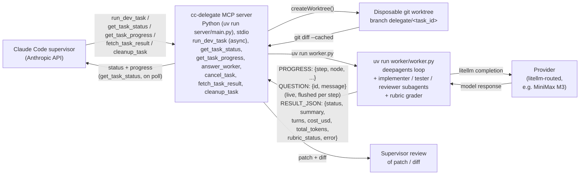

# cc-delegate

Delegate heavy dev tasks from Claude Code (Opus supervisor) to an autonomous worker on a cheaper
model, via MCP. The worker is provider-agnostic — any model litellm can route to works. It
currently defaults to MiniMax M3, but that's just a default, not a limitation.

The supervisor stays on Anthropic; only the worker is billed on the alternate provider.

## Architecture



- **`cc-delegate` MCP server** (`server/main.py`, official `mcp` Python SDK, run via
  `uv run`) — exposes the delegation tools to the supervisor over stdio: `run_dev_task` (start
  a delegated task — preflights your `test_command` first — and return a `task_id` immediately;
  the worker runs in the background), `get_task_status` (cheap liveness: running / needs_input /
  done — poll it as often as you like), `get_task_progress` (verbose audit: files written so far,
  recent activity, cost — call occasionally), `answer_worker` (reply to a worker blocked on a
  question), `steer_task` (proactively redirect a *running* worker at any moment — not only in
  reply to a question — delivered at its next tool call), `cancel_task` (kill a stalled/runaway
  worker's whole process tree, salvaging its work), `fetch_task_result` (final summary, patch,
  files changed, cost — including salvaged work from failed runs), and `cleanup_task` (tear down
  a finished task's worktree, branch, and persisted job file).
- **Job persistence** — every job is mirrored to `<repo>/.cc-delegate/jobs/<task_id>.json` on
  each state change, so `get_task_status` / `fetch_task_result` / `cleanup_task` still work
  across MCP-server restarts: the in-memory registry is rebuilt from disk on demand.
- **Delegate worker** (`worker/worker.py`) — a [deepagents](https://github.com/langchain-ai/deepagents)
  agent, run as a subprocess via `uv run` (see `server/worker_launcher.py`). Uses `LocalShellBackend` in
  `virtual_mode=True` to keep filesystem/shell access scoped to the disposable git worktree
  (branch `delegate/<task_id>`), `SubAgent`s for implementer/tester/reviewer roles, and
  `RubricMiddleware` to grade completion against `definition_of_done`/`test_command` instead of
  trusting the model's own "I'm done" judgment. Each run reports real `cost_usd` and
  `total_tokens` via a litellm success callback so the supervisor knows what the delegation
  actually cost, and prints a flushed `PROGRESS:` line per graph step so `get_task_status`
  shows what the worker is doing without waiting for completion.
- **Packaged skill** (`skills/delegate-heavy-dev/SKILL.md`) — teaches the supervisor when and
  how to delegate.

## Supervision model — async, scheduled polling

`run_dev_task` returns a `task_id` **immediately** and the worker runs in the background, so the
supervisor stays free. It never blocks waiting: **a standard MCP server cannot push into the
model's context**, so the worker can't call the supervisor — but the supervisor doesn't need to
sit blocked either. It ends its turn (free) and re-checks on a cadence **it schedules itself**
(a scheduled wake-up / background wait re-invokes it, e.g. "I'll check in ~2 min", or it simply
checks when you next speak). Between checks, you have the supervisor's full attention.

Two polling tools, split by cost so frequent checks stay cheap:

- **`get_task_status`** — a tiny payload (`running` / `needs_input` / `done`, plus the pending
  question if the worker is blocked). Poll it as often as you like; it barely touches the context.
- **`get_task_progress`** — a verbose audit (files written so far, recent shell commands, step,
  cost, elapsed). Heavier, so the supervisor calls it occasionally, or when you ask "how's it
  going?", and relays a one-line update.

On `needs_input` the supervisor decides at its discretion: answer from its own context with
`answer_worker`, or relay it to you when it's genuinely your call. On `done` it reviews with
`fetch_task_result`. (Why not a blocking "watch" call or MCP progress notifications? Both were
tried and removed: a blocking call freezes the supervisor for the whole run, and progress
notifications never enter the model's context and aren't rendered by the desktop app.)

For **large work**, the supervisor decomposes into bounded sub-tasks and runs independent ones
(different files) in **parallel** — each `run_dev_task` gets its own worktree/branch — while
serializing sub-tasks that touch the same files to avoid merge conflicts.

## Status line — always-visible ambient indicator (TUI)

For a passive, glance-able view without asking the supervisor, the **status line** keeps a
one-line summary *in Claude Code's status bar*, token-free (TUI only — the desktop app does not
render custom status lines). While a delegation runs:

```
⏳ delegate t_…yqsldx · MiniMax-M3 · step 24 · writing src/auth/tokens.js
⚠ delegate t_…yqsldx · asks: which token TTL? · → answer_worker
✓ delegate t_…yqsldx · done · 4 files · $0.24
```

How it stays token-free on both ends: the MCP server (already resident for the session) renders
the line in Python and writes it to `~/.cc-delegate/statusline`; the status-line script Claude
Code runs is a dependency-free reader (no `jq`, no `python`, no JSON parsing) that just prints
the pre-baked line while it is fresh. The harness runs it locally — it never consumes API tokens.

Wire it once in `~/.claude/settings.json` (point `command` at the shipped reader; **`refreshInterval`
is required** — status-line event triggers go quiet while the session waits on the background
worker, so the timer is what keeps the line live):

```json
{
  "statusLine": {
    "type": "command",
    "command": "~/.claude/cc-delegate-statusline.sh",
    "refreshInterval": 2
  }
}
```

Copy `statusline/cc-delegate-statusline.sh` (or, on Windows without Git Bash, the `.ps1`
variant) to `~/.claude/` and `chmod +x` it. A running task refreshes the line on every event; a
blocked task keeps its question visible until you answer; a finished task shows a short-lived
summary that then fades — no stale state left on screen.

## Worker → supervisor communication (and back)

The worker is not fire-and-forget anymore. Three tools are injected into its agent loop:

- **`report_progress(update)`** — fire-and-forget one-liners at phase transitions; they surface
  through `get_task_progress` and the status line.
- **`ask_supervisor(question, context)`** — blocks the worker (zero tokens spent while
  waiting) and flips the task to status `needs_input`. The supervisor discovers the question the
  next time it polls `get_task_status`, answers from its own context or relays it to the user,
  then replies with `answer_worker(task_id, answer)` and the worker resumes. If no answer arrives
  within `DELEGATE_ASK_TIMEOUT_S` (default 600s), the worker proceeds on its best conservative
  judgment.
- **`report_blocker(problem, attempts)`** — same mechanism, for "I've failed 3 times at the
  same error" situations: the supervisor gets a chance to correct course instead of the worker
  thrashing until timeout.

Answers travel out-of-band through a file mailbox in `<repo>/.cc-delegate/comm/<task_id>/` —
never through the model conversation.

**The other direction: `steer_task(task_id, message)`** lets the supervisor redirect a *running*
worker at any moment, not only in reply to a question — "stop implementing X, do Y instead". It
doesn't block the worker or change its status; the message sits in the same mailbox until the
worker's next tool call opportunistically picks it up (typically within seconds — there's no way
to interrupt an in-flight LangGraph step from outside without a checkpointer, which the current
architecture doesn't have). Verified end-to-end: a message dropped mid-task surfaced in the next
shell command's output, and the model genuinely changed course on its very next turn.

We started with the worker calling `@anthropic-ai/claude-agent-sdk`'s `query()` pointed at a
third-party endpoint, then tried shelling out to CLI coding agents (OpenCode, `dcode`) — both hit
either an unresolved Claude Code CLI headless-auth bug or a Windows/no-TTY hang in `dcode`'s rich
terminal UI. Calling `deepagents` directly as a library sidesteps both: no CLI, no TTY dependency,
and it gives us real control over the loop (subagents, rubric-based convergence) instead of a
black-box CLI. See [KNOWN_ISSUES.md](KNOWN_ISSUES.md) for the Claude Agent SDK auth bug writeup.

## Install

Installing the plugin itself is one command (below), but two things live outside Claude Code's
control and won't be set up for you: a model API key and `uv`. Neither is guaranteed just
because you have Claude Code. Go through these in order:

**1. Get a worker API key.** Default target is MiniMax — sign up at
[platform.minimax.io](https://platform.minimax.io) and generate a key. (Using a different
provider instead? Skip ahead to [Configuration](#configuration).)

**2. Install [uv](https://docs.astral.sh/uv/getting-started/installation/)**, if `uv --version`
doesn't already show it. That's the only runtime prerequisite: `uv run` resolves the MCP
server's and the worker's inline Python dependencies (and Python itself, if needed) on first
use — no `pip install`, no Node.js, no build step.

**3. Set `DELEGATE_API_KEY` as a persistent environment variable, then restart Claude Code.**
This is the step most likely to trip you up: `.mcp.json`'s `${DELEGATE_API_KEY}` only reads the
OS-level environment of the process that launched Claude Code — there's no `.env` file
auto-loading and no interactive prompt. Setting it in a terminal *after* Claude Code is already
running does nothing until you restart it from a shell that has the variable.

```powershell
# Windows (PowerShell) — persists across terminals, requires restarting Claude Code after
[Environment]::SetEnvironmentVariable("DELEGATE_API_KEY", "your-key-here", "User")
```

```bash
# macOS/Linux — add to ~/.zshrc or ~/.bashrc, then open a new shell
export DELEGATE_API_KEY="your-key-here"
```

**4. Install the plugin.**

```
/plugin marketplace add EtienneLescot/cc-delegate
/plugin install cc-delegate@cc-delegate-marketplace
```

Or locally during development: `claude --plugin-dir .`

**5. Verify.** Run `/mcp` — this is the checkpoint that surfaces a missing `uv`/key before
you're mid-task. A `SessionStart` hook (`hooks.json`) additionally probes `uv --version` at the
start of every session as an earlier best-effort check; it's written in exec-form (no shell) so
it behaves the same on Windows/macOS/Linux, but a hook failure isn't guaranteed to surface as a
friendly message in the transcript — treat it as a bonus signal, not the primary one.

### For maintainers

No build step. The server is plain Python (`server/`, stdlib + the `mcp` SDK declared inline in
`main.py`); the worker is `worker/worker.py`. Run the test suite with:

```bash
uv run python -m unittest discover -s server -p "test_*.py"
```

## Verify

- `/mcp` should list the `cc-delegate` server and its tools.
- `/status` in the supervisor session should still show `api.anthropic.com` — no worker
  config ever leaks into the supervisor process.
- Ask the supervisor to delegate a heavy task; it should call `run_dev_task`, poll
  `get_task_status`, then present the diff via `fetch_task_result`.

## Safety

The worker's `LocalShellBackend` runs in `virtual_mode=True`, scoping filesystem and shell access
to the disposable git worktree. `git push`/`merge`/`rebase` are **enforced**, not just prompted
against — `SupervisedShellBackend` blocks them at the tool level (a worker only ever operates on
its own disposable branch, so there's never a legitimate reason to touch shared history itself).
The supervisor always reviews the resulting diff before deciding whether to merge branch
`delegate/<task_id>`.

**Budget cap.** `run_dev_task(..., max_budget_usd=...)` (default from `DELEGATE_MAX_BUDGET_USD`,
$5) stops the worker as soon as accumulated cost crosses the cap, instead of running unbounded —
checked after every step against the live cost tracker.

## Configuration

**The facade (preferred):** the plugin configures itself through its own MCP tools, driven
conversationally from Claude Code — no restart needed, changes apply to the next task:

- *"Show me the provider status"* → `provider_status` lists your model profiles, the default,
  and per-profile auth state (key reachable? OAuth token cache present?).
- *"Add a deepseek profile"* → `set_model_profile("deepseek", "litellm:deepseek/deepseek-chat",
  "DEEPSEEK_API_KEY")`; `set_default_profile` / `remove_model_profile` manage the menu.
- *"Add a fallback to deepseek if MiniMax fails"* → `set_model_profile("mm", "litellm:minimax/MiniMax-M3",
  "MINIMAX_API_KEY", fallback_models=["litellm:deepseek/deepseek-chat"])` — tried in order via
  litellm's own fallback mechanism if the primary model's call fails.
- *"Store my key for the deepseek profile"* → `store_api_key("deepseek")` asks you for the key
  through a native Claude Code dialog (MCP elicitation, Claude Code >= 2.1.199): **the secret
  goes straight back to the server without ever entering the model's conversation.**
- Per task: *"delegate this on the deepseek profile"* → `run_dev_task(..., profile="deepseek")`.
  The supervisor's skill forbids it from picking a non-default profile on its own.

Profiles live in `~/.cc-delegate/config.json`, facade-stored keys in
`~/.cc-delegate/credentials.json`. Any litellm-routable model works — see
[litellm's provider list](https://docs.litellm.ai/docs/providers).

**Subscription providers (OAuth):** for a profile on an OAuth provider — GitHub Copilot
(`set_model_profile("copilot", "litellm:github_copilot/gpt-5")`, no API key) or ChatGPT
(`set_model_profile("chatgpt", "litellm:chatgpt/gpt-5.3-codex")`) — run
`setup_provider_auth("<profile>")`. It returns a verification URL and a user code; visit the URL,
enter the code, authorize, and `auth_poll(flow_id)` flips to `authorized`. litellm caches the
tokens, so later runs need no interaction and the key never touches the config.

**A note on ToS**, since this varies by provider: OpenAI tolerates and actively supports
third-party tools using a ChatGPT subscription this way (its *Codex for Open Source* program
lists such tools explicitly) — not a contractual guarantee, but an established norm. GitHub
Copilot's device flow is likewise widely used by third-party editors and tools. Anthropic
prohibits subscription use outside Claude Code itself, and Google does the equivalent for Gemini
CLI — cc-delegate does not and will not implement OAuth for either.

**Legacy env path (still supported):** see [`.env.example`](.env.example) for
`DELEGATE_API_KEY`, `DELEGATE_MODEL`, `DELEGATE_API_KEY_ENV_VAR`, and the guardrails
(`DELEGATE_RECURSION_LIMIT`, `DELEGATE_RUBRIC_MAX_ITERATIONS`, `DELEGATE_TIMEOUT_MS`). It
applies when no profile is defined; env changes require restarting Claude Code (the
restart-trap warning in Install step 3 only concerns this path).

`DELEGATE_MAX_BUDGET_USD` is accepted and surfaced in `cost_usd`, but it is not yet enforced
mid-run: deepagents/LangGraph has no built-in budget cut-off hook, so the value is reported for
visibility rather than as a hard stop.

## License

MIT for this repository's own code. See [`NOTICE`](NOTICE) for a note on third-party terms of use.
