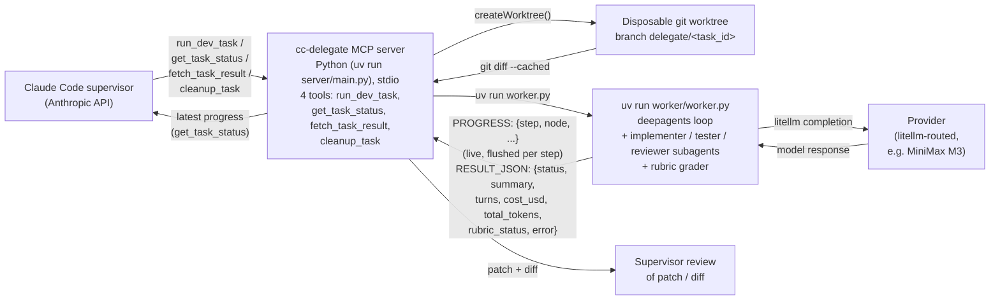

# cc-delegate

Delegate heavy dev tasks from Claude Code (Opus supervisor) to an autonomous worker on a cheaper
model, via MCP. The worker is provider-agnostic — any model litellm can route to works. It
currently defaults to MiniMax M3, but that's just a default, not a limitation.

The supervisor stays on Anthropic; only the worker is billed on the alternate provider.

## Architecture



- **`cc-delegate` MCP server** (`server/main.py`, official `mcp` Python SDK, run via
  `uv run`) — exposes four tools to the supervisor over stdio: `run_dev_task` (start a
  delegated task and return a `task_id`), `get_task_status` (poll — reflects live `PROGRESS:`
  updates as the worker streams them), `fetch_task_result` (read the final summary, patch,
  files changed, cost, and tokens), and `cleanup_task` (tear down a finished task's worktree,
  branch, and persisted job file).
- **Job persistence** — every job is mirrored to `<repo>/.cc-delegate/jobs/<task_id>.json` on
  each state change, so `get_task_status` / `fetch_task_result` / `cleanup_task` still work
  across MCP-server restarts: the in-memory registry is rebuilt from disk on demand.
- **Delegate worker** (`worker/worker.py`) — a [deepagents](https://github.com/langchain-ai/deepagents)
  agent, run as a subprocess via `uv run` (see `server/worker_launcher.py`). Uses `LocalShellBackend` in
  `virtual_mode=True` to keep filesystem/shell access scoped to the disposable git worktree
  (branch `delegate/<task_id>`), `SubAgent`s for implementer/tester/reviewer roles, and
  `RubricMiddleware` to grade completion against `definition_of_done`/`test_command` instead of
  trusting the model's own "I'm done" judgment. Each run reports real `cost_usd` and
  `total_tokens` via a litellm success callback so the supervisor knows what the delegation
  actually cost, and prints a flushed `PROGRESS:` line per graph step so `get_task_status`
  shows what the worker is doing without waiting for completion.
- **Packaged skill** (`skills/delegate-heavy-dev/SKILL.md`) — teaches the supervisor when and
  how to delegate.

We started with the worker calling `@anthropic-ai/claude-agent-sdk`'s `query()` pointed at a
third-party endpoint, then tried shelling out to CLI coding agents (OpenCode, `dcode`) — both hit
either an unresolved Claude Code CLI headless-auth bug or a Windows/no-TTY hang in `dcode`'s rich
terminal UI. Calling `deepagents` directly as a library sidesteps both: no CLI, no TTY dependency,
and it gives us real control over the loop (subagents, rubric-based convergence) instead of a
black-box CLI. See [KNOWN_ISSUES.md](KNOWN_ISSUES.md) for the Claude Agent SDK auth bug writeup.

## Install

Installing the plugin itself is one command (below), but two things live outside Claude Code's
control and won't be set up for you: a model API key and `uv`. Neither is guaranteed just
because you have Claude Code. Go through these in order:

**1. Get a worker API key.** Default target is MiniMax — sign up at
[platform.minimax.io](https://platform.minimax.io) and generate a key. (Using a different
provider instead? Skip ahead to [Configuration](#configuration).)

**2. Install [uv](https://docs.astral.sh/uv/getting-started/installation/)**, if `uv --version`
doesn't already show it. That's the only runtime prerequisite: `uv run` resolves the MCP
server's and the worker's inline Python dependencies (and Python itself, if needed) on first
use — no `pip install`, no Node.js, no build step.

**3. Set `DELEGATE_API_KEY` as a persistent environment variable, then restart Claude Code.**
This is the step most likely to trip you up: `.mcp.json`'s `${DELEGATE_API_KEY}` only reads the
OS-level environment of the process that launched Claude Code — there's no `.env` file
auto-loading and no interactive prompt. Setting it in a terminal *after* Claude Code is already
running does nothing until you restart it from a shell that has the variable.

```powershell
# Windows (PowerShell) — persists across terminals, requires restarting Claude Code after
[Environment]::SetEnvironmentVariable("DELEGATE_API_KEY", "your-key-here", "User")
```

```bash
# macOS/Linux — add to ~/.zshrc or ~/.bashrc, then open a new shell
export DELEGATE_API_KEY="your-key-here"
```

**4. Install the plugin.**

```
/plugin marketplace add EtienneLescot/cc-delegate
/plugin install cc-delegate@cc-delegate-marketplace
```

Or locally during development: `claude --plugin-dir .`

**5. Verify.** Run `/mcp` — this is the checkpoint that surfaces a missing `uv`/key before
you're mid-task. A `SessionStart` hook (`hooks.json`) additionally probes `uv --version` at the
start of every session as an earlier best-effort check; it's written in exec-form (no shell) so
it behaves the same on Windows/macOS/Linux, but a hook failure isn't guaranteed to surface as a
friendly message in the transcript — treat it as a bonus signal, not the primary one.

### For maintainers

No build step. The server is plain Python (`server/`, stdlib + the `mcp` SDK declared inline in
`main.py`); the worker is `worker/worker.py`. Run the test suite with:

```bash
uv run python -m unittest discover -s server -p "test_*.py"
```

## Verify

- `/mcp` should list the `cc-delegate` server and its four tools.
- `/status` in the supervisor session should still show `api.anthropic.com` — no worker
  config ever leaks into the supervisor process.
- Ask the supervisor to delegate a heavy task; it should call `run_dev_task`, poll
  `get_task_status`, then present the diff via `fetch_task_result`.

## Safety

The worker's `LocalShellBackend` runs in `virtual_mode=True`, scoping filesystem and shell access
to the disposable git worktree — it never runs `git push` or merges (also enforced via its system
prompt). The supervisor always reviews the resulting diff before deciding whether to merge branch
`delegate/<task_id>`.

## Configuration

**The facade (preferred):** the plugin configures itself through its own MCP tools, driven
conversationally from Claude Code — no restart needed, changes apply to the next task:

- *"Show me the provider status"* → `provider_status` lists your model profiles, the default,
  and per-profile auth state (key reachable? OAuth token cache present?).
- *"Add a deepseek profile"* → `set_model_profile("deepseek", "litellm:deepseek/deepseek-chat",
  "DEEPSEEK_API_KEY")`; `set_default_profile` / `remove_model_profile` manage the menu.
- *"Store my key for the deepseek profile"* → `store_api_key("deepseek")` asks you for the key
  through a native Claude Code dialog (MCP elicitation, Claude Code >= 2.1.199): **the secret
  goes straight back to the server without ever entering the model's conversation.**
- Per task: *"delegate this on the deepseek profile"* → `run_dev_task(..., profile="deepseek")`.
  The supervisor's skill forbids it from picking a non-default profile on its own.

Profiles live in `~/.cc-delegate/config.json`, facade-stored keys in
`~/.cc-delegate/credentials.json`. Any litellm-routable model works — see
[litellm's provider list](https://docs.litellm.ai/docs/providers).

**Legacy env path (still supported):** see [`.env.example`](.env.example) for
`DELEGATE_API_KEY`, `DELEGATE_MODEL`, `DELEGATE_API_KEY_ENV_VAR`, and the guardrails
(`DELEGATE_RECURSION_LIMIT`, `DELEGATE_RUBRIC_MAX_ITERATIONS`, `DELEGATE_TIMEOUT_MS`). It
applies when no profile is defined; env changes require restarting Claude Code (the
restart-trap warning in Install step 3 only concerns this path).

`DELEGATE_MAX_BUDGET_USD` is accepted and surfaced in `cost_usd`, but it is not yet enforced
mid-run: deepagents/LangGraph has no built-in budget cut-off hook, so the value is reported for
visibility rather than as a hard stop.

## License

MIT for this repository's own code. See [`NOTICE`](NOTICE) for a note on third-party terms of use.
