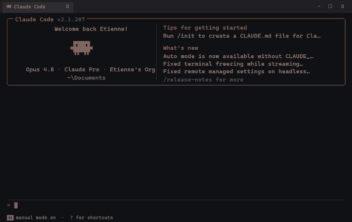
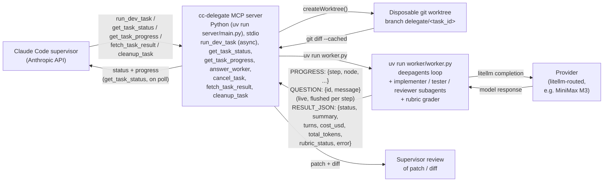

<div align="center">

# cc-delegate

**Delegate a whole dev task from your Opus supervisor to a cheaper worker model —**
**isolated in a git worktree, graded against a rubric, reviewed as one clean diff.**

[](LICENSE)
&nbsp;[](https://docs.claude.com/en/docs/claude-code/overview)
&nbsp;[](https://docs.astral.sh/uv/)



</div>

Your **supervisor** (Claude Code on Opus) stays on Anthropic and keeps planning and reviewing.
A **worker** on any cheaper, litellm-routable model does the heavy implementation in the
background — in its own git worktree. You review a diff at the end, not a stream of half-finished
edits. The worker defaults to MiniMax M3, but that's a default, not a limitation: only the worker
is billed on the alternate provider.

## Why cc-delegate

- **Whole tasks, not per-call routing.** One `run_dev_task` hands off a complete bounded task —
  implement, test, iterate — behind a single tool call, instead of routing individual completions.
- **Isolated in a disposable git worktree.** Every task runs on its own `delegate/<task_id>`
  branch. Nothing touches your working tree until you review the diff and merge.
- **"Done" is graded, not claimed.** A rubric middleware checks the result against *your*
  `definition_of_done` and `test_command` — the worker doesn't declare victory on its own say-so.
- **Async by design.** `run_dev_task` returns a `task_id` immediately; the worker runs in the
  background. The supervisor stays free for you and polls on a cadence it schedules itself.
- **Provider-agnostic.** Any model litellm can route to (100+ providers). The supervisor never
  leaves Anthropic; only the worker runs on the alternate provider.
- **Two-way steering.** The worker asks blocking questions when it's genuinely stuck; the
  supervisor redirects it mid-run with `steer_task`. Neither costs a turn until a decision needs one.
- **Bounded and safe.** An enforced budget cap, an enforced (not just prompted) `git
  push`/`merge`/`rebase` block, a stall watchdog, and real per-run cost tracking.

## Architecture



**The MCP server** (`server/main.py`, official `mcp` Python SDK, run via `uv run`) exposes the
delegation tools to the supervisor over stdio:

| Tool | What it does |
|---|---|
| `run_dev_task` | Start a delegated task (preflights your `test_command` first) and return a `task_id` **immediately** — the worker runs in the background. |
| `get_task_status` | Cheap liveness: `running` / `needs_input` / `done`. Poll it as often as you like. |
| `get_task_progress` | Verbose audit: files written so far, recent activity, cost. Call occasionally. |
| `answer_worker` | Reply to a worker blocked on a question. |
| `steer_task` | Redirect a *running* worker at any moment — delivered at its next tool call. |
| `cancel_task` | Kill a stalled/runaway worker's whole process tree, salvaging its work. |
| `fetch_task_result` | Final summary, patch, files changed, cost — including salvaged work from failed runs. |
| `cleanup_task` | Tear down a finished task's worktree, branch, and persisted job file. |

- **Job persistence** — every job is mirrored to `<repo>/.cc-delegate/jobs/<task_id>.json` on each
  state change, so status, result, and cleanup queries survive MCP-server restarts: the in-memory
  registry is rebuilt from disk on demand.
- **The worker** (`worker/worker.py`) is a [deepagents](https://github.com/langchain-ai/deepagents)
  agent, run as a subprocess via `uv run`. It uses `LocalShellBackend` in `virtual_mode=True` to
  scope filesystem and shell access to the worktree, `SubAgent`s for implementer/tester/reviewer
  roles, and `RubricMiddleware` to grade completion against your `definition_of_done`/`test_command`
  instead of trusting the model's own "I'm done". Each run reports real `cost_usd` and
  `total_tokens` via a litellm callback, and prints a flushed `PROGRESS:` line per step.
- **The packaged skill** (`skills/delegate-heavy-dev/SKILL.md`) teaches the supervisor when and how
  to delegate.

## Supervision model — async, scheduled polling

`run_dev_task` returns a `task_id` **immediately** and the worker runs in the background. The
supervisor never blocks: a standard MCP server can't push into the model's context, so the worker
can't call the supervisor — but the supervisor doesn't need to sit and wait either. It ends its
turn (free) and re-checks on a cadence **it schedules itself** — a background wait re-invokes it
("I'll check in ~2 min"), or it simply checks when you next speak. Between checks, you have its
full attention.

Two polling tools, split by cost so frequent checks stay cheap:

- **`get_task_status`** — a tiny payload (`running` / `needs_input` / `done`, plus the pending
  question if blocked). Poll it freely; it barely touches the context.
- **`get_task_progress`** — a verbose audit (files written, recent shell commands, step, cost,
  elapsed). Heavier, so the supervisor calls it occasionally, or when you ask "how's it going?".

On `needs_input`, the supervisor decides: answer from its own context with `answer_worker`, or
relay the question to you when it's genuinely your call. On `done`, it reviews with
`fetch_task_result`.

> Why not a blocking "watch" call or MCP progress notifications? Both were tried and removed — a
> blocking call freezes the supervisor for the whole run, and progress notifications never enter
> the model's context and aren't rendered by the desktop app.

For **large work**, the supervisor decomposes into bounded sub-tasks and runs independent ones
(different files) in **parallel** — each `run_dev_task` gets its own worktree/branch — while
serializing sub-tasks that touch the same files to avoid merge conflicts.

## Status line — always-visible ambient indicator (TUI)

For a passive, glance-able view without asking the supervisor, the **status line** keeps a
one-line summary *in Claude Code's status bar*, token-free (TUI only — the desktop app does not
render custom status lines):

```
⏳ delegate t_…yqsldx · MiniMax-M3 · step 24 · writing src/auth/tokens.js
⚠ delegate t_…yqsldx · asks: which token TTL? · → answer_worker
✓ delegate t_…yqsldx · done · 4 files · $0.24
```

It stays token-free on both ends: the MCP server (already resident) renders the line in Python and
writes it to `~/.cc-delegate/statusline`; the status-line script Claude Code runs is a
dependency-free reader (no `jq`, no `python`, no JSON parsing) that just prints the pre-baked line
while it's fresh. The harness runs it locally — it never consumes API tokens.

Wire it once in `~/.claude/settings.json` (**`refreshInterval` is required** — status-line event
triggers go quiet while the session waits on the background worker, so the timer keeps the line
live):

```json
{
  "statusLine": {
    "type": "command",
    "command": "~/.claude/cc-delegate-statusline.sh",
    "refreshInterval": 2
  }
}
```

Copy `statusline/cc-delegate-statusline.sh` (or, on Windows without Git Bash, the `.ps1` variant)
to `~/.claude/` and `chmod +x` it. A running task refreshes the line on every event; a blocked
task keeps its question visible until you answer; a finished task shows a short-lived summary that
then fades — no stale state left on screen.

## Worker ↔ supervisor communication (and steering)

The worker is not fire-and-forget. Three tools are injected into its agent loop:

- **`report_progress(update)`** — fire-and-forget one-liners at phase transitions; they surface
  through `get_task_progress` and the status line.
- **`ask_supervisor(question, context)`** — blocks the worker (zero tokens while waiting) and flips
  the task to `needs_input`. The supervisor discovers the question on its next `get_task_status`
  poll, answers from its own context or relays it to you, then replies with `answer_worker`. If no
  answer arrives within `DELEGATE_ASK_TIMEOUT_S` (default 600s), the worker proceeds on its best
  conservative judgment.
- **`report_blocker(problem, attempts)`** — same mechanism, for "I've failed 3 times at the same
  error": the supervisor can correct course instead of letting the worker thrash until timeout.

Answers travel out-of-band through a file mailbox in `<repo>/.cc-delegate/comm/<task_id>/` — never
through the model conversation.

**The other direction — `steer_task(task_id, message)`** lets the supervisor redirect a *running*
worker at any moment, not only in reply to a question: *"stop implementing X, do Y instead."* It
doesn't block the worker or change its status; the message sits in the mailbox until the worker's
next tool call opportunistically picks it up (typically within seconds — interrupting an in-flight
LangGraph step from outside would need a checkpointer, which this architecture doesn't have).
Verified end-to-end: a message dropped mid-task surfaced in the next shell command's output, and
the model changed course on its very next turn.

<details>
<summary><b>Why deepagents-as-a-library, not a CLI agent</b></summary>

We started with the worker calling `@anthropic-ai/claude-agent-sdk`'s `query()` pointed at a
third-party endpoint, then tried shelling out to CLI coding agents (OpenCode, `dcode`) — both hit
either an unresolved Claude Code CLI headless-auth bug or a Windows/no-TTY hang in `dcode`'s rich
terminal UI. Calling `deepagents` directly as a library sidesteps both: no CLI, no TTY dependency,
and real control over the loop (subagents, rubric-based convergence) instead of a black-box CLI.
The full story — three worker engines, two upstream bugs — is in
[docs/build-journey.md](docs/build-journey.md); the reproducible bug reports are in
[KNOWN_ISSUES.md](KNOWN_ISSUES.md).

</details>

## How this compares

None of these are direct competitors — each targets a different point in the design space, and we
haven't used them hands-on, so treat this as directional rather than exhaustive:

| | **cc-delegate** | [houtini-lm](https://github.com/houtini-ai/houtini-lm) | [Roo Code](https://docs.roocode.com/features/boomerang-tasks) Orchestrator |
|---|---|---|---|
| Unit of delegation | A whole bounded task (multi-turn, its own agent loop) | A single bounded call, routed per request | A subtask within Roo's own orchestrator/mode system |
| Isolation | Disposable git worktree + branch per task | None (stateless call-through) | Own context per subtask; no git-level isolation |
| "Is it actually done?" | `RubricMiddleware` grades against your `definition_of_done`/`test_command` — not the model's own say-so | Caller decides; no built-in completion gate | Orchestrator reads back the subtask's summary |
| Where it plugs in | A Claude Code plugin (MCP) — supervisor stays Opus/Anthropic | An MCP server, also aimed at Claude Code | A standalone VS Code extension (not a Claude Code plugin) |
| Provider reach | Any litellm-routable provider (100+) | LM Studio, Ollama, vLLM, DeepSeek, Groq, Cerebras | Per-mode provider config, incl. local via LiteLLM |
| Supervisor cost model | Async: `run_dev_task` returns immediately, supervisor polls on its own schedule | Synchronous: caller waits on each delegated call | Synchronous: orchestrator waits on each subtask |

**In practice**: cc-delegate delegates the *whole task* — implement, test, iterate — behind one
call, with the worktree isolating it from your working branch and the rubric grader deciding "done"
instead of the model. houtini-lm's per-call routing fits better if you want fine-grained control
over which model handles which individual completion; Roo Code's orchestrator fits better if you
want a full standalone IDE rather than a Claude Code plugin.

## Install

Installing the plugin is one command, but two things live outside Claude Code's control: a model
API key and `uv`. Neither is guaranteed just because you have Claude Code. Go in order:

**1. Get a worker API key.** The default target is MiniMax — sign up at
[platform.minimax.io](https://platform.minimax.io) and generate a key. (Using a different provider?
Skip ahead to [Configuration](#configuration).)

**2. Install [uv](https://docs.astral.sh/uv/getting-started/installation/)** if `uv --version`
doesn't already show it. That's the only runtime prerequisite: `uv run` resolves the server's and
worker's inline Python dependencies (and Python itself, if needed) on first use — no `pip install`,
no Node.js, no build step.

**3. Set `DELEGATE_API_KEY` as a persistent environment variable, then restart Claude Code.** This
is the step most likely to trip you up: `.mcp.json`'s `${DELEGATE_API_KEY}` only reads the OS-level
environment of the process that launched Claude Code — there's no `.env` auto-loading and no
interactive prompt. Setting it *after* Claude Code is already running does nothing until you restart
from a shell that has the variable.

```powershell
# Windows (PowerShell) — persists across terminals; restart Claude Code afterward
[Environment]::SetEnvironmentVariable("DELEGATE_API_KEY", "your-key-here", "User")
```

```bash
# macOS/Linux — add to ~/.zshrc or ~/.bashrc, then open a new shell
export DELEGATE_API_KEY="your-key-here"
```

**4. Install the plugin.**

```
/plugin marketplace add EtienneLescot/cc-delegate
/plugin install cc-delegate@cc-delegate-marketplace
```

Or locally during development: `claude --plugin-dir .`

**5. Verify.** Run `/mcp` — the checkpoint that surfaces a missing `uv`/key before you're mid-task.
A `SessionStart` hook additionally probes `uv --version` at the start of every session as an
earlier best-effort check (exec-form, so it behaves the same on Windows/macOS/Linux) — treat it as
a bonus signal, not the primary one.

### For maintainers

No build step. The server is plain Python (`server/`, stdlib + the `mcp` SDK declared inline in
`main.py`); the worker is `worker/worker.py`. Run the test suite with:

```bash
uv run python -m unittest discover -s server -p "test_*.py"
```

Verify the wiring end-to-end:

- `/mcp` lists the `cc-delegate` server and its tools.
- `/status` in the supervisor session still shows `api.anthropic.com` — no worker config ever leaks
  into the supervisor process.
- Ask the supervisor to delegate a heavy task; it should call `run_dev_task`, poll
  `get_task_status`, then present the diff via `fetch_task_result`.

## Configuration

**The facade (preferred).** The plugin configures itself through its own MCP tools, driven
conversationally from Claude Code — no restart needed, changes apply to the next task:

- *"Show me the provider status"* → `provider_status` lists your model profiles, the default, and
  per-profile auth state (key reachable? OAuth token cache present?).
- *"Add a deepseek profile"* → `set_model_profile("deepseek", "litellm:deepseek/deepseek-chat",
  "DEEPSEEK_API_KEY")`; `set_default_profile` / `remove_model_profile` manage the menu.
- *"Add a fallback to deepseek if MiniMax fails"* → `set_model_profile("mm",
  "litellm:minimax/MiniMax-M3", "MINIMAX_API_KEY",
  fallback_models=["litellm:deepseek/deepseek-chat"])` — tried in order via litellm's own fallback
  mechanism if the primary model's call fails.
- *"Store my key for the deepseek profile"* → `store_api_key("deepseek")` asks for the key through a
  native Claude Code dialog (MCP elicitation, Claude Code ≥ 2.1.199): **the secret goes straight
  back to the server without ever entering the model's conversation.**
- Per task: *"delegate this on the deepseek profile"* → `run_dev_task(..., profile="deepseek")`. The
  supervisor's skill forbids it from picking a non-default profile on its own.

Profiles live in `~/.cc-delegate/config.json`, facade-stored keys in
`~/.cc-delegate/credentials.json`. Any litellm-routable model works — see
[litellm's provider list](https://docs.litellm.ai/docs/providers).

**Subscription providers (OAuth).** For a profile on an OAuth provider — GitHub Copilot
(`set_model_profile("copilot", "litellm:github_copilot/gpt-5")`, no API key) or ChatGPT
(`set_model_profile("chatgpt", "litellm:chatgpt/gpt-5.3-codex")`) — run
`setup_provider_auth("<profile>")`. It returns a verification URL and a user code; visit the URL,
enter the code, authorize, and `auth_poll(flow_id)` flips to `authorized`. litellm caches the
tokens, so later runs need no interaction and the key never touches the config.

> **A note on ToS**, since this varies by provider: OpenAI tolerates and actively supports
> third-party tools using a ChatGPT subscription this way (its *Codex for Open Source* program lists
> such tools explicitly) — an established norm, not a contractual guarantee. GitHub Copilot's device
> flow is likewise widely used by third-party editors. Anthropic prohibits subscription use outside
> Claude Code itself, and Google does the equivalent for Gemini CLI — cc-delegate does not and will
> not implement OAuth for either.

**Legacy env path (still supported).** See [`.env.example`](.env.example) for `DELEGATE_API_KEY`,
`DELEGATE_MODEL`, `DELEGATE_API_KEY_ENV_VAR`, and the guardrails (`DELEGATE_RECURSION_LIMIT`,
`DELEGATE_RUBRIC_MAX_ITERATIONS`, `DELEGATE_TIMEOUT_MS`, `DELEGATE_STALL_TIMEOUT_S`,
`DELEGATE_MAX_BUDGET_USD`). This path applies when no profile is defined; env changes require
restarting Claude Code (the restart trap in Install step 3 only concerns this path).

## Safety

- **Worktree confinement.** The worker's `LocalShellBackend` runs in `virtual_mode=True`, scoping
  filesystem and shell access to the disposable worktree. The supervisor always reviews the diff
  before deciding whether to merge branch `delegate/<task_id>`.
- **Enforced git guard.** `git push`/`merge`/`rebase` are **blocked at the tool level** by
  `SupervisedShellBackend`, not just prompted against — a worker only ever operates on its own
  disposable branch, so there's never a legitimate reason to touch shared history.
- **Budget cap.** `run_dev_task(..., max_budget_usd=...)` (default from `DELEGATE_MAX_BUDGET_USD`,
  $5) stops the worker as soon as accumulated cost crosses the cap — checked after every step
  against the live cost tracker, so a run can't drift unbounded.
- **Stall watchdog.** If the worker goes silent longer than `DELEGATE_STALL_TIMEOUT_S` (default
  300s) — e.g. a hung provider call inside rubric grading — its process tree is killed and the run
  fails fast instead of hanging until the full 30-minute run timeout. Salvage still runs, so
  completed work isn't lost. A worker legitimately waiting on `answer_worker` is exempt.
- **Secret-safe by construction.** The worker's shell environment is filtered of anything matching
  `API_KEY`/`TOKEN`/`SECRET`/`PASSWORD`/`CREDENTIAL`; facade-stored keys and OAuth tokens never
  enter the model's conversation.

## License

MIT for this repository's own code. See [`NOTICE`](NOTICE) for a note on third-party terms of use.
